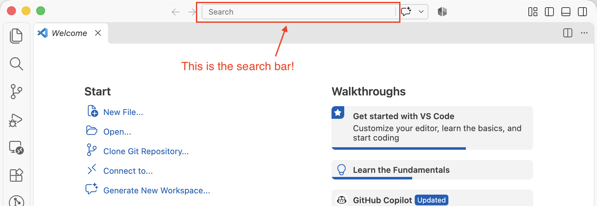
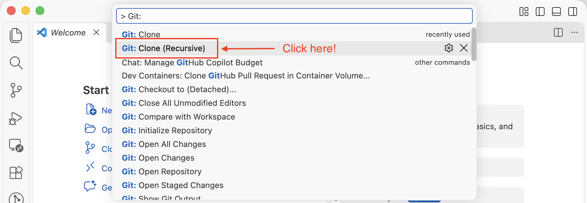
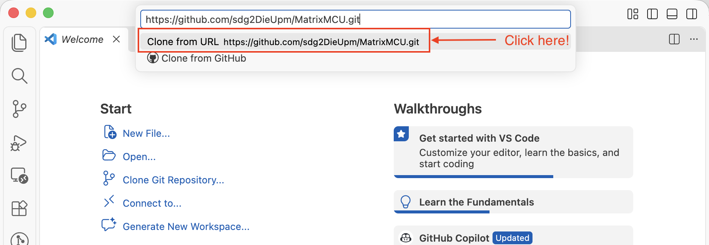

# Installation instructions for using the [`MatrixMCU`](https://github.com/sdg2DieUpm/MatrixMCU) toolkit

The **MatrixMCU** toolkit has been tested for the 3 most important Operating Systems and it is intended to be used with the Visual Studio Code editor.
Here you can find the installation steps for MacOS, Windows, and Linux.

## Prerequisites

You must install additional tools to make `MatrixMCU` work.

1. Install [Visual Studio Code](https://code.visualstudio.com)
2. Install [Git](https://git-scm.com/install/)
3. Clone this repository **recursively** and move to the `MatrixMCU` directory:
    - Open Visual Studio Code.
    - Click on the search bar:

    - Start typing the following text: `"> Git: clone recursive"`.As you type, Visual Studio Code will suggest you different tasks.
> [!IMPORTANT]
>
> Don't forget to type the first `>` in the text!
> Otherwise, Visual Studio Code will not recognize that you want to run a task.
-
    - Click on **Git: Clone (recursive)**

    - In the URL text box, insert the URL of this repository:
```
https://github.com/sdg2DieUpm/MatrixMCU.git
```
-
    - Click on *"Clone from URL"*

    - Select the directory of your computer where you want to clone MatrixMCU.
    - When asked if you would like to open the newly cloned repository, click on *Open*.

> [!NOTE]
>
> From now on, we will refer to MatrixMCU's directory as `<PATH_TO_MATRIX_MCU>`.

Next, depending on the Operating System of your computer, follow the next steps.

## MacOS

First, we must install [Homebrew](https://brew.sh) on our Mac.
If you have not done it yet, open a terminal and insert the following command:
```bash
/bin/bash -c "$(curl -fsSL https://raw.githubusercontent.com/Homebrew/install/HEAD/install.sh)"
```
The script explains what it will do and then pauses before it does it.

To check if Homebrew was installed correctly, **open a new terminal** and insert the following command:
```bash
brew --version
```
This command should output the version of Homebrew installed on your Mac.

Once you have Homebrew on your Mac, move to MatrixMCU's directory in the terminal:
```
cd <PATH_TO_MATRIXMCU>
```
Then, run the script `macos.sh`:
```
source install/macos.sh
```

To check that the installation succeeded, run the following commands **ONE BY ONE**:
```bash
arm-none-eabi-gcc --version
```
```bash
arm-none-eabi-g++ --version
```
```bash
arm-none-eabi-gdb --version
```
```bash
arm-none-eabi-objcopy --version
```
```bash
arm-none-eabi-objdump --version
```
Each of these commands should output the current version of the tool under study, as well as other additional details about the software.

## Windows

We will use the Windows Subsystem for Linux (WSL).
WSL allows developers to install a Linux distribution (such as Ubuntu, OpenSUSE, Kali, Debian, Arch Linux, etc.) and use Bash applications, utilities, and command-line tools directly on Windows, unmodified, without the overhead of a traditional virtual machine or dual-boot configuration.

First, open Windows PowerShell as an administrator by right-clicking and selecting "Run as administrator". Next, insert the following command to install WSL:
```
wsl --install -d Ubuntu-26.04
```
Once done (it might take a while), you must restart your PC to apply all the changes.

Now, we have WSL with the latest version of Ubuntu installed on our machine.
If you search "Ubuntu" in your applications, you will find an executable that runs an Ubuntu shell on top of WSL.
You will find more information about how to configure your WSL development environment [here](https://learn.microsoft.com/es-es/windows/wsl/setup/environment?source=recommendations).

Next, open a Ubuntu terminal. The first time, it will take some time to install the operating system.
You must also create a new user for the Ubuntu subsystem.
This step is only done once, so **make sure to remember the user name and the password**, as you will need to provide them every time you open a new Ubuntu terminal

Let's make sure that we have Ubuntu 24.04 or later.
To do so, once logged in Ubuntu, insert the next command:

```bash
cat /etc/lsb-release
```

You should see something like:

```
DISTRIB_ID=Ubuntu
DISTRIB_RELEASE=26.04
DISTRIB_CODENAME=resolute
DISTRIB_DESCRIPTION="Ubuntu 26.04.1 LTS"
```

### Connecting USB Devices to WSL

In this course, we will need to connect our STM32 board to WSL.
This is not available by default in WSL, so we need to install `usbipd-win` first.
To do so, follow the next steps:

1. Open Windows PowerShell **as an administrator** by right-clicking and selecting "Run as administrator".
2. Run the following command **in the Windows PowerShell**:

```bash
winget install usbipd
```

The `winget` package manager will probably ask you to accept the terms of use.
Insert `Y` in your PowerShell terminal to accept them.
You will need to restart your PC to apply the required changes.

To check that `usbipd-win` is properly installed, follow the next steps:

1. Open Windows PowerShell **as an administrator** by right-clicking and selecting "Run as administrator".
2. Run the following command **in the Windows PowerShell**:

```bash
usbipd --help
```

> [!NOTE]
> You can find more information about `usbipd-win` in its [GitHub repository](https://github.com/dorssel/usbipd-win).

Next, to connect a USB device to WSL, we must first share it.
To do so, follow these steps:
1. Make sure that you have an Ubuntu terminal running. Otherwise, it will not be possible to attach any USB device.
2. Open Windows PowerShell **as an administrator** by right-clicking and selecting "Run as administrator".
3. Run the following command **in the Windows PowerShell** to check all the USB devices connected to Windows:

```
usbipd list
```

If you have your STM32 board connected, you will see something like:

```
BUSID   VID:PID     DEVICE                                                          STATE
(...)
1-4     0483:374b   ST-Link Debug, Dispositivo de almacenamiento USB, STMicro...    Not attached
(...)
```

The ST-Link Debug is the USB controller of our STM32 board. Note down the `VID:PID` field (in this example, `0483:374b`.
In your case, the number may differ).
We will need it to identify which USB device we want to attach to WSL.

4. By default devices are not shared with USBIP clients. Run the following command **in the Windows PowerShell** to share the USB device with your Ubuntu system:

```
usbipd bind --hardware-id 0483:374b
```

Sharing a device is persistent; it survives reboots. Therefore, you don't need to do this again.

5. Next, let's attach the STM32 board to WSL. Insert the following command in a Windows PowerShell:

```
usbipd attach --wsl -a -i 0483:374b
```

Make sure that you insert the correct hardware number for your board!
If the number does not coincide with this example, you will need to modify the command.
If everything goes well, your PowerShell terminal will prompt something like this:
```
usbpid: info: Device with hardware-id <VID-PID> found at busid <BUSID>.
usbpid info: Starting endless attach loop; press Ctrl+C to quit.
Attached
```
Leave the PowerShell terminal open. It will make sure to keep your board connected to Ubuntu.
You can close it after closing the Ubuntu terminal.

Attaching devices to WSL is non-persistent.
You will have to re-attach after a reboot, or when the device resets or is physically unplugged/replugged.

> [!TIP]
> You can install the [USBIP Connect Plugin](https://marketplace.visualstudio.com/items?itemName=thecreativedodo.usbip-connect) in VSCode to attach and detach your board from VSCode instead of using a PowerShell.

6. To make sure that your board is connected to Ubuntu, run the following command **In the Ubuntu terminal**:
```
lsusb
```
You should be able to see your ST-Link Debug probe connected to your Ubuntu terminal.

> [!NOTE]
> If Ubuntu complains about finding `lsusb`, you might not have `usbutils` installed yet. Enter the following command:
> ```bash
> sudo apt install usbutils
> ```
> Remember to accept the terms of use by entering `Y` in the terminal!

### Installing the Dependencies on the Ubuntu Subsytem

Next, follow the installation instructions for Ubuntu **from the Ubuntu terminal**, not the Windows PowerShell.

## Linux

### Native C (first semester)

On Debian and Debian-based distributions, including Ubuntu in WSL, run the
dedicated installer from a clone of this installation repository:

```bash
git clone https://github.com/sdg2DieUpm/install-MatrixMCU.git
cd install-MatrixMCU
bash native-linux.sh
```

Git must be installed before cloning. A recursive clone is not needed for this
native installer. If you already have a clone, run `bash native-linux.sh` there.

It installs GCC/G++, Make, CMake, GDB, and Git. To check the available commands
without changing the system, run `bash native-linux.sh --check`. Then install the
[MatrixMCU: Native C/C++ Extension Pack](https://marketplace.visualstudio.com/items?itemName=sdgdieupm.matrixmcu-c-native)
manually from VS Code. The [student guide](https://sdg2dieupm.github.io/install-MatrixMCU-guide/c-nativo.html)
contains the installation steps.

### STM32 cross-compilation on Ubuntu

First, move to MatrixMCU's directory in a terminal:
```
cd <PATH_TO_MATRIXMCU>
```
Then, if your OS is Ubuntu 22, run the script `ubuntu22.sh` in a terminal:
```bash
source install/ubuntu22.sh
```
Alternatively, if your OS is Ubuntu 24, run the script `ubuntu24.sh` in a terminal:
```bash
source install/ubuntu24.sh
```
Finally, if your OS is Ubuntu 26, run the script `ubuntu26.sh` in a terminal:
```bash
source install/ubuntu26.sh
```

Don't forget to insert `Y` in the terminal every time Ubuntu asks you if you want to continue.

Once you are done, reload the `.bashrc` settings on your terminal:
```bash
source ~/.bashrc
```

To check that the installation succeeded, run the following commands **ONE BY ONE**:
```bash
arm-none-eabi-gcc --version
```
```bash
arm-none-eabi-g++ --version
```
```bash
arm-none-eabi-gdb --version
```
```bash
arm-none-eabi-objcopy --version
```
```bash
arm-none-eabi-objdump --version
```
Each of these commands should output the current version of the tool under study, as well as other additional details about the software.

## Fedora

> [!CAUTION]
> This script has not been thoroughly tested througout the subject yet. Use responsibly.

First, we must install [`git`](https://git-scm.com) in our system.
If you have not done it yet, open a terminal and insert the following commands:
```bash
sudo dnf update
sudo dnf upgrade
sudo dnf install git
```

Don't forget to insert `Y` in the terminal every time Fedora asks you if you want to continue.

Next, clone this repo and move to the cloned directory:
```
git clone https://github.com/sdg2DieUpm/install-MatrixMCU.git && cd install-MatrixMCU
```
Run the script `fedora43.sh` in a terminal:
```bash
source fedora43.sh
```
This script has been used in Fedora 43. If you have another version, you may need to adapt it.

Once you are done, reload the `.bashrc` settings on your terminal:
```bash
source ~/.bashrc
```

To check that the installation succeeded, run the following commands **ONE BY ONE**:
```bash
arm-none-eabi-gcc --version
```
```bash
arm-none-eabi-g++ --version
```
```bash
arm-none-eabi-gdb --version
```
```bash
arm-none-eabi-objcopy --version
```
```bash
arm-none-eabi-objdump --version
```
Each of these commands should output the current version of the tool under study, as well as other additional details about the software.


### Issues when trying to connect with OpenOCD?

```bash
$ sudo cp -a udev/rules.d/* /etc/udev/rules.d/
$ sudo udevadm control --reload
# If previous command triggers an error, try with:
$ sudo service udev restart
```
